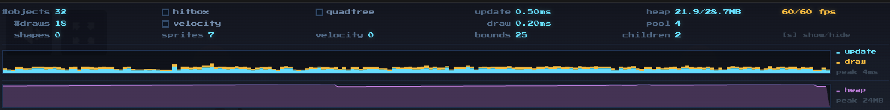

# melonJS Debug Plugin


[](https://github.com/melonjs/es6-boilerplate/blob/master/LICENSE)
[](https://www.npmjs.com/package/@melonjs/debug-plugin)
[](https://www.jsdelivr.com/package/npm/@melonjs/debug-plugin)

Installation
-------------------------------------------------------------------------------
`$ [sudo] npm install @melonjs/debug-plugin`

Then import and instantiate the debug plugin in your project. For example:
```JavaScript
import { utils, plugin } from 'melonjs';

// dynamically import the plugin
import("@melonjs/debug-plugin").then((debugPlugin) => {
    // automatically register the debug panel
    utils.function.defer(plugin.register, this, debugPlugin.DebugPanelPlugin, "debugPanel");
});
```

Usage
-------------------------------------------------------------------------------

The Debug Panel is hidden by default and can be displayed using the `S` key. It provides a compact HUD overlay with real-time engine diagnostics:



The panel displays the following information across three rows:

* **#objects** — number of objects currently active in the scene
* **#draws** — number of draw operations per frame
* **hitbox / velocity / quadtree** — toggle checkboxes for debug overlays
* **Update / Draw** — frame update and draw time in milliseconds
* **Heap** — JS heap memory usage (used/total in MB, Chrome only)
* **Pool** — number of objects currently in the object pool
* **FPS** — current vs target frame rate
* **Shapes / Sprites / Velocity / Bounds / Children** — per-frame counters for active engine objects

Below the stats, two sparkline graphs show:
* **Frame time graph** — stacked update (cyan) and draw (amber) times with a target frame time indicator
* **Memory graph** — JS heap usage over time (Chrome only)

> Note: Heap memory information is only available in Chromium-based browsers (Chrome, Edge, Opera) via the `performance.memory` API, which is deprecated but has no real-time alternative yet.

Additionally, using the checkboxes in the panel it is also possible to draw:
* Shape and bounding box for all objects
* Current velocity vector
* Quadtree spatial visualization

Questions, need help ?
-------------------------------------------------------------------------------
If you need technical support, you can contact us through the following channels :
* Chat: come and chat with us on [discord](https://discord.gg/aur7JMk)
* [Wiki](https://github.com/melonjs/melonJS/wiki) with useful links, tutorials, and anything related to melonJS
